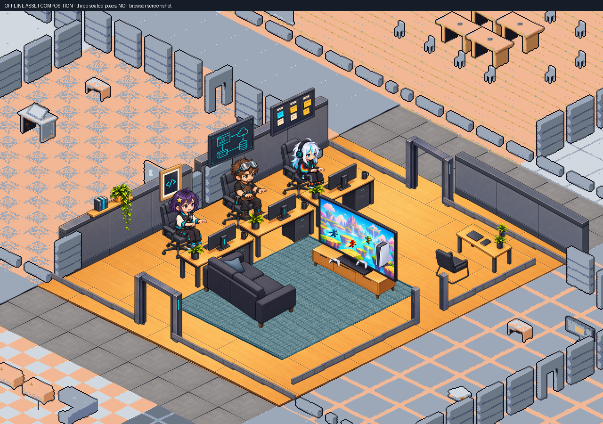
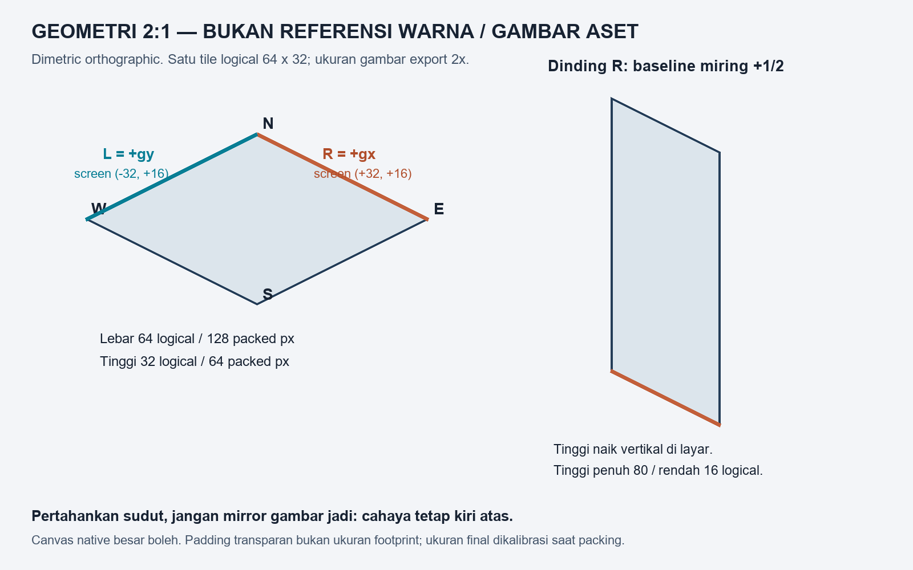
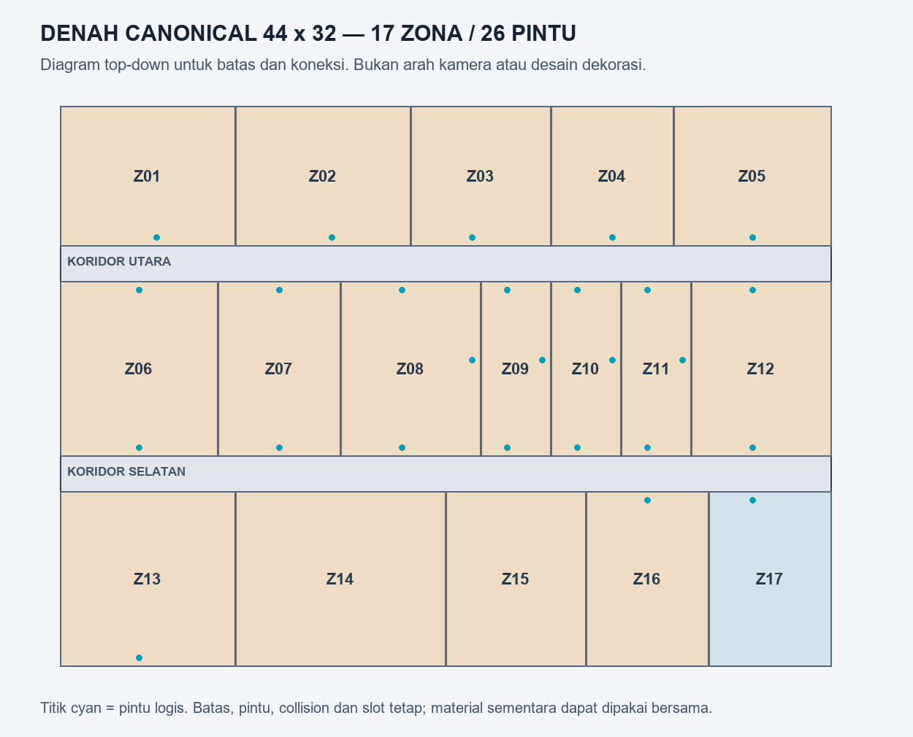

# Mulai dari lingkungan dasar kantor

**38 prompt: 36 inti + 2 opsional**, dengan foto referensi asli Dot, panduan geometri dan denah canonical. Paket prompt sudah siap; artwork baru belum digenerate atau dipasang.

## Cara pakai di GPT web

1. Mulai dari F01 (oak), W01/W02 (dinding dua arah), lalu P01 (pilar) untuk mengunci bahan dan cahaya. Lanjutkan seluruh kelompok 01–07. Semua prompt sudah mandiri; master style tidak perlu dipaste ulang.
2. Buka file .txt suatu asset di folder `prompts`. Attach PNG dari daftar **Input images to attach** di prompt tersebut, sesuai urutan, dari folder `references`. Paste seluruh prompt, lalu generate satu asset. Gambar `09-denah-canonical.png` untuk memahami batas kantor; bukan instruksi membuat seluruh kantor dalam satu gambar.
3. Download PNG asli hasil GPT (bukan screenshot atau preview JPEG); simpan di `results` dengan nama yang tertulis di prompt. Satu PNG = satu komponen. Gambar hitam pada preview reference transparan bukan permintaan background hitam.
4. ZIP folder results per kelompok (lantai, dinding, pilar, pintu, kaca, transisi, outdoor) atau sekaligus dan kirim balik. Tidak perlu menjadikan semua asset satu spritesheet. File opsional G03/G04 tidak wajib untuk tahap inti.
5. Jika gambar salah, gunakan `REPAIR_PROMPT.txt` dengan hasil generated sebagai edit target. Sumber Dot adalah referensi, bukan otomatis asset modular yang sudah lulus seam/alpha/geometri.

## Batas tahap ini

Pertahankan suasana Z08: oak hangat, panel blue-gray, trim charcoal, aksen cyan kecil dan cahaya kiri atas. Struktur dipakai ulang di seluruh 17 zona. Material indoor sementara F01/F02 dipakai bersama; tema/dekorasi per ruangan diputuskan nanti. Pintu, batas, 133 slot dan jalur tidak digeser untuk menyesuaikan hasil gambar.

Sengaja tidak ada prompt karakter, meja, kursi, sofa, TV, rug, tanaman, poster, papan atau penataan ruangan. Kusen/window/pilar adalah struktur. Kolam Z17 sudah ada pada denah: air dan bibirnya termasuk dasar lingkungan; kursi/umbrella/dekorasinya ditunda. Tidak ada penambahan lantai gedung, tangga, elevator, atap yang menutupi interior atau zona baru.

## Definisi 100% lingkungan general

Status 100% baru tercapai setelah seluruh asset inti digenerate, alpha/geometri/seam diperiksa dan dipacking, lalu seluruh lantai/struktur lama di 17 zona dan dua koridor diganti tanpa merusak 26 pintu dan jalur. Asset inti harus dipasang dan diperiksa di browser pada overview/detail, tema terang/gelap, seam lantai 3×3, sambungan dinding, sudut, kusen serta batas kolam. Foto yang terlihat bagus saja belum memenuhi ini. G03/G04 adalah pilihan partisi kaca untuk penataan berikutnya.

**Saat paket ini dibuat: 0/36 asset inti baru telah digenerate; pemasangan foundation belum dimulai.** Asset Dot sebelumnya adalah sumber referensi. `MAP_COVERAGE.json` mencatat seluruh tipe lantai/dinding dan 26 pintu dari map aktual; pemilihan arah dan pivot final dilakukan saat assembly.

## Daftar prompt dan foto yang perlu diattach

| ID | Asset | Status | Foto / panduan | Prompt |
|---|---|---|---|---|
| F01 | Lantai oak utama | Inti | [01-geometri-2-to-1.png](references/01-geometri-2-to-1.png), [02-oak-reference.png](references/02-oak-reference.png) | [Buka](prompts/01-lantai/F01-floor-oak-a.txt) |
| F02 | Variasi lantai oak | Inti | [01-geometri-2-to-1.png](references/01-geometri-2-to-1.png), [02-oak-reference.png](references/02-oak-reference.png) | [Buka](prompts/01-lantai/F02-floor-oak-b.txt) |
| F03 | Lantai koridor abu-abu | Inti | [01-geometri-2-to-1.png](references/01-geometri-2-to-1.png), [03-wall-tall-R-reference.png](references/03-wall-tall-R-reference.png), [02-oak-reference.png](references/02-oak-reference.png) | [Buka](prompts/01-lantai/F03-floor-corridor-gray.txt) |
| F04 | Lantai outdoor antiselip | Inti | [01-geometri-2-to-1.png](references/01-geometri-2-to-1.png), [03-wall-tall-R-reference.png](references/03-wall-tall-R-reference.png), [02-oak-reference.png](references/02-oak-reference.png) | [Buka](prompts/01-lantai/F04-floor-outdoor-stone.txt) |
| F05 | Tepi platform R | Inti | [01-geometri-2-to-1.png](references/01-geometri-2-to-1.png), [03-wall-tall-R-reference.png](references/03-wall-tall-R-reference.png) | [Buka](prompts/01-lantai/F05-platform-edge-r.txt) |
| F06 | Tepi platform L | Inti | [01-geometri-2-to-1.png](references/01-geometri-2-to-1.png), [04-wall-tall-L-reference.png](references/04-wall-tall-L-reference.png) | [Buka](prompts/01-lantai/F06-platform-edge-l.txt) |
| F07 | Sudut depan platform | Inti | [01-geometri-2-to-1.png](references/01-geometri-2-to-1.png), [03-wall-tall-R-reference.png](references/03-wall-tall-R-reference.png), [04-wall-tall-L-reference.png](references/04-wall-tall-L-reference.png) | [Buka](prompts/01-lantai/F07-platform-corner-s.txt) |
| W01 | Dinding tinggi R, 1 modul | Inti | [01-geometri-2-to-1.png](references/01-geometri-2-to-1.png), [03-wall-tall-R-reference.png](references/03-wall-tall-R-reference.png) | [Buka](prompts/02-dinding/W01-wall-tall-r-1u.txt) |
| W02 | Dinding tinggi L, 1 modul | Inti | [01-geometri-2-to-1.png](references/01-geometri-2-to-1.png), [04-wall-tall-L-reference.png](references/04-wall-tall-L-reference.png) | [Buka](prompts/02-dinding/W02-wall-tall-l-1u.txt) |
| W03 | Dinding tinggi R, 2 modul | Inti | [01-geometri-2-to-1.png](references/01-geometri-2-to-1.png), [03-wall-tall-R-reference.png](references/03-wall-tall-R-reference.png) | [Buka](prompts/02-dinding/W03-wall-tall-r-2u.txt) |
| W04 | Dinding tinggi L, 2 modul | Inti | [01-geometri-2-to-1.png](references/01-geometri-2-to-1.png), [04-wall-tall-L-reference.png](references/04-wall-tall-L-reference.png) | [Buka](prompts/02-dinding/W04-wall-tall-l-2u.txt) |
| W05 | Dinding rendah R, 1 modul | Inti | [01-geometri-2-to-1.png](references/01-geometri-2-to-1.png), [05-wall-low-R-reference.png](references/05-wall-low-R-reference.png) | [Buka](prompts/02-dinding/W05-wall-low-r-1u.txt) |
| W06 | Dinding rendah L, 1 modul | Inti | [01-geometri-2-to-1.png](references/01-geometri-2-to-1.png), [06-wall-low-L-reference.png](references/06-wall-low-L-reference.png) | [Buka](prompts/02-dinding/W06-wall-low-l-1u.txt) |
| W07 | Dinding rendah R, 2 modul | Inti | [01-geometri-2-to-1.png](references/01-geometri-2-to-1.png), [05-wall-low-R-reference.png](references/05-wall-low-R-reference.png) | [Buka](prompts/02-dinding/W07-wall-low-r-2u.txt) |
| W08 | Dinding rendah L, 2 modul | Inti | [01-geometri-2-to-1.png](references/01-geometri-2-to-1.png), [06-wall-low-L-reference.png](references/06-wall-low-L-reference.png) | [Buka](prompts/02-dinding/W08-wall-low-l-2u.txt) |
| W09 | Sudut belakang dinding tinggi | Inti | [01-geometri-2-to-1.png](references/01-geometri-2-to-1.png), [03-wall-tall-R-reference.png](references/03-wall-tall-R-reference.png), [04-wall-tall-L-reference.png](references/04-wall-tall-L-reference.png) | [Buka](prompts/02-dinding/W09-wall-corner-n-tall.txt) |
| W10 | Sudut depan dinding rendah | Inti | [01-geometri-2-to-1.png](references/01-geometri-2-to-1.png), [05-wall-low-R-reference.png](references/05-wall-low-R-reference.png), [06-wall-low-L-reference.png](references/06-wall-low-L-reference.png) | [Buka](prompts/02-dinding/W10-wall-corner-s-low.txt) |
| P01 | Pilar sambungan tinggi | Inti | [01-geometri-2-to-1.png](references/01-geometri-2-to-1.png), [08-pillar-reference.png](references/08-pillar-reference.png) | [Buka](prompts/03-pilar/P01-pillar-tall.txt) |
| P02 | Post sambungan rendah | Inti | [01-geometri-2-to-1.png](references/01-geometri-2-to-1.png), [08-pillar-reference.png](references/08-pillar-reference.png), [05-wall-low-R-reference.png](references/05-wall-low-R-reference.png) | [Buka](prompts/03-pilar/P02-post-low.txt) |
| D01 | Kusen terbuka R | Inti | [01-geometri-2-to-1.png](references/01-geometri-2-to-1.png), [07-doorframe-reference.png](references/07-doorframe-reference.png), [03-wall-tall-R-reference.png](references/03-wall-tall-R-reference.png) | [Buka](prompts/04-pintu/D01-door-open-r.txt) |
| D02 | Kusen terbuka L | Inti | [01-geometri-2-to-1.png](references/01-geometri-2-to-1.png), [07-doorframe-reference.png](references/07-doorframe-reference.png), [04-wall-tall-L-reference.png](references/04-wall-tall-L-reference.png) | [Buka](prompts/04-pintu/D02-door-open-l.txt) |
| D03 | Kusen depan rendah R | Inti | [01-geometri-2-to-1.png](references/01-geometri-2-to-1.png), [07-doorframe-reference.png](references/07-doorframe-reference.png), [05-wall-low-R-reference.png](references/05-wall-low-R-reference.png) | [Buka](prompts/04-pintu/D03-door-cutaway-r.txt) |
| D04 | Kusen depan rendah L | Inti | [01-geometri-2-to-1.png](references/01-geometri-2-to-1.png), [07-doorframe-reference.png](references/07-doorframe-reference.png), [06-wall-low-L-reference.png](references/06-wall-low-L-reference.png) | [Buka](prompts/04-pintu/D04-door-cutaway-l.txt) |
| D05 | Kusen entrance R | Inti | [01-geometri-2-to-1.png](references/01-geometri-2-to-1.png), [07-doorframe-reference.png](references/07-doorframe-reference.png), [03-wall-tall-R-reference.png](references/03-wall-tall-R-reference.png) | [Buka](prompts/04-pintu/D05-door-entrance-r.txt) |
| D06 | Kusen entrance L | Inti | [01-geometri-2-to-1.png](references/01-geometri-2-to-1.png), [07-doorframe-reference.png](references/07-doorframe-reference.png), [04-wall-tall-L-reference.png](references/04-wall-tall-L-reference.png) | [Buka](prompts/04-pintu/D06-door-entrance-l.txt) |
| G01 | Jendela R | Inti | [01-geometri-2-to-1.png](references/01-geometri-2-to-1.png), [03-wall-tall-R-reference.png](references/03-wall-tall-R-reference.png), [07-doorframe-reference.png](references/07-doorframe-reference.png) | [Buka](prompts/05-jendela-kaca/G01-window-r.txt) |
| G02 | Jendela L | Inti | [01-geometri-2-to-1.png](references/01-geometri-2-to-1.png), [04-wall-tall-L-reference.png](references/04-wall-tall-L-reference.png), [07-doorframe-reference.png](references/07-doorframe-reference.png) | [Buka](prompts/05-jendela-kaca/G02-window-l.txt) |
| G03 | Partisi kaca opsional R | Opsional | [01-geometri-2-to-1.png](references/01-geometri-2-to-1.png), [03-wall-tall-R-reference.png](references/03-wall-tall-R-reference.png), [07-doorframe-reference.png](references/07-doorframe-reference.png) | [Buka](prompts/05-jendela-kaca/G03-partition-r.txt) |
| G04 | Partisi kaca opsional L | Opsional | [01-geometri-2-to-1.png](references/01-geometri-2-to-1.png), [04-wall-tall-L-reference.png](references/04-wall-tall-L-reference.png), [07-doorframe-reference.png](references/07-doorframe-reference.png) | [Buka](prompts/05-jendela-kaca/G04-partition-l.txt) |
| J01 | Ambang lantai R | Inti | [01-geometri-2-to-1.png](references/01-geometri-2-to-1.png), [07-doorframe-reference.png](references/07-doorframe-reference.png), [02-oak-reference.png](references/02-oak-reference.png) | [Buka](prompts/06-transisi/J01-threshold-r.txt) |
| J02 | Ambang lantai L | Inti | [01-geometri-2-to-1.png](references/01-geometri-2-to-1.png), [07-doorframe-reference.png](references/07-doorframe-reference.png), [02-oak-reference.png](references/02-oak-reference.png) | [Buka](prompts/06-transisi/J02-threshold-l.txt) |
| O01 | Permukaan air kolam | Inti | [01-geometri-2-to-1.png](references/01-geometri-2-to-1.png), [00-suasana-z08.png](references/00-suasana-z08.png), [03-wall-tall-R-reference.png](references/03-wall-tall-R-reference.png) | [Buka](prompts/07-outdoor-kolam/O01-pool-water.txt) |
| O02 | Bibir kolam R | Inti | [01-geometri-2-to-1.png](references/01-geometri-2-to-1.png), [03-wall-tall-R-reference.png](references/03-wall-tall-R-reference.png), [02-oak-reference.png](references/02-oak-reference.png) | [Buka](prompts/07-outdoor-kolam/O02-pool-coping-r.txt) |
| O03 | Bibir kolam L | Inti | [01-geometri-2-to-1.png](references/01-geometri-2-to-1.png), [04-wall-tall-L-reference.png](references/04-wall-tall-L-reference.png), [02-oak-reference.png](references/02-oak-reference.png) | [Buka](prompts/07-outdoor-kolam/O03-pool-coping-l.txt) |
| O04 | Sudut bibir kolam N | Inti | [01-geometri-2-to-1.png](references/01-geometri-2-to-1.png), [03-wall-tall-R-reference.png](references/03-wall-tall-R-reference.png), [04-wall-tall-L-reference.png](references/04-wall-tall-L-reference.png) | [Buka](prompts/07-outdoor-kolam/O04-pool-coping-corner-n.txt) |
| O05 | Sudut bibir kolam S | Inti | [01-geometri-2-to-1.png](references/01-geometri-2-to-1.png), [03-wall-tall-R-reference.png](references/03-wall-tall-R-reference.png), [04-wall-tall-L-reference.png](references/04-wall-tall-L-reference.png) | [Buka](prompts/07-outdoor-kolam/O05-pool-coping-corner-s.txt) |
| O06 | Sudut bibir kolam E | Inti | [01-geometri-2-to-1.png](references/01-geometri-2-to-1.png), [03-wall-tall-R-reference.png](references/03-wall-tall-R-reference.png), [04-wall-tall-L-reference.png](references/04-wall-tall-L-reference.png) | [Buka](prompts/07-outdoor-kolam/O06-pool-coping-corner-e.txt) |
| O07 | Sudut bibir kolam W | Inti | [01-geometri-2-to-1.png](references/01-geometri-2-to-1.png), [03-wall-tall-R-reference.png](references/03-wall-tall-R-reference.png), [04-wall-tall-L-reference.png](references/04-wall-tall-L-reference.png) | [Buka](prompts/07-outdoor-kolam/O07-pool-coping-corner-w.txt) |

## Foto suasana (referensi, bukan target layout)

