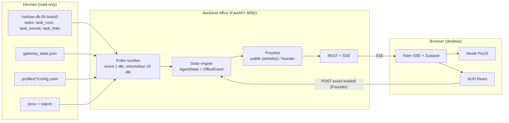

# 1. Master Architecture Blueprint

Office v2 adalah aplikasi read-only tiga lapis. Backend membaca state Hermes, mengubahnya jadi state office, lalu menyiarkannya lewat SSE ke world isometrik di browser. Tidak ada satu pun write ke runtime Hermes.



Data hanya mengalir dari Hermes ke browser. Satu-satunya arah balik adalah POST event kolektif dari Founder, dan itu berhenti di state engine office. Office tidak pernah menulis ke Hermes.

### Lapisan dan modul

| Lapisan | Modul | Tanggung jawab |
| --- | --- | --- |
| Sumber | `sources/kanban.py` | Menemukan board (`kanban.db` + `kanban/boards/*/kanban.db`), membukanya read-only, lalu poll `task_events` dengan cursor `id` per board |
| Sumber | `sources/gateway.py` | Membaca `gateway_state.json` hanya saat `mtime` berubah |
| Sumber | `sources/profiles.py` | Membaca `profiles/<name>/config.yaml` + `agents.yaml` langsung dari file, tanpa CLI |
| Sumber | `sources/host.py` | CPU% dari delta `/proc/stat`, RAM dari `MemAvailable`, disk dari `os.statvfs` |
| Domain | `domain/normalizer.py` | Mengubah row mentah jadi `OfficeEvent` |
| Domain | `domain/state.py` | Menurunkan `AgentState` per agent dan `WorldSnapshot` |
| Domain | `domain/collective.py` | Event kolektif manual (rapat, break, sholat): state di memori dengan TTL |
| Proyeksi | `projection/public.py`, `projection/founder.py` | Redaksi: satu state, dua tampilan |
| Transport | `api/rest.py`, `api/stream.py`, `api/auth.py` | Snapshot REST, SSE, login Founder |
| Frontend | `world/` (PixiJS) | Tilemap, kamera, karakter, choreographer, bubble, atmosfer |
| Frontend | `hud/` (React) | Top bar, feed, inspector, daftar agent, kontrol Founder |
| Frontend | `data/` | Klien SSE, store Zustand, tipe hasil generate dari OpenAPI |

### Interval polling

| Sumber | Interval | Catatan |
| --- | --- | --- |
| `task_events` semua board | 1 dtk | `WHERE id > :cursor ORDER BY id LIMIT 500`, cursor per board |
| Rekonsiliasi `tasks` | 10 dtk | Snapshot task running/blocked per assignee untuk mengoreksi event yang terlewat |
| Penemuan board baru | 30 dtk | Glob direktori `boards/` |
| `gateway_state.json` | 2 dtk | Cek `mtime` dulu, parse hanya kalau berubah |
| Profil agent | 60 dtk |  |
| Vitals host | 5 dtk |  |

Koneksi SQLite memakai `file:<path>?mode=ro` (URI), `PRAGMA query_only=ON`, `busy_timeout=2000`, dan dijalankan lewat `asyncio.to_thread`. Event `heartbeat` tidak masuk feed; event ini hanya memperbarui `last_seen` untuk mendeteksi task macet.

### Model domain

```python
class AgentState(BaseModel):
    id: str                       # "forge"
    presence: Literal["on_duty", "off_duty"]
    work: Literal["idle", "working", "blocked", "stale", "failed", "done_recent"]
    task: TaskRef | None          # task running/blocked terbaru (sudah diredaksi per proyeksi)
    since: int                    # epoch detik, awal status sekarang
    done_today: int               # tasks.completed_at >= 00:00 Asia/Jakarta

class OfficeEvent(BaseModel):
    seq: int                      # urutan global office, monoton
    ts: int
    board: str
    kind: Literal["task_created", "task_started", "task_commented", "task_blocked",
                  "task_done", "task_failed", "task_stale", "agent_online",
                  "agent_offline", "collective_started", "collective_ended", "vitals_alert"]
    agent: str | None             # agent yang terdampak
    actor: str | None             # mis. penulis komentar ("jarvis")
    task: TaskRef | None
```

### Turunan status agent

Agent pemilik task diambil dari `task_runs.profile`; kalau kosong, dari `tasks.assignee`. Nama di luar 15 agent digambar sebagai karakter tamu generik.

| Kondisi di Hermes | `work` | Yang terlihat di office |
| --- | --- | --- |
| Task `running`, heartbeat < 120 dtk | `working` | Di zona kerjanya dengan animasi kerja dan badge task di atas kepala |
| Task `running`, heartbeat ≥ 120 dtk | `stale` | Duduk bengong dengan ikon jam pasir |
| Task `blocked`, `block_kind=needs_input` | `blocked` | Berjalan ke pintu ruang Jarvis sambil angkat tangan |
| Task `blocked`, jenis lain | `blocked` | Di meja dengan ikon gembok |
| Run berakhir `crashed` / `timed_out` / `spawn_failed` | `failed` (60 dtk) | Asap kecil dari monitor, Bastion datang mengecek |
| Run berakhir `completed` | `done_recent` (45 dtk) | Selebrasi khas karakter, lalu kembali ke ambient |
| Tidak ada task aktif | `idle` | Dikendalikan ambient scheduler |
| Profil `stopped` | `off_duty` | Tidak ada di lantai kerja; papan absen di lobi menandai "off" |

### Kontrak API v1

| Method | Path | Akses | Isi |
| --- | --- | --- | --- |
| GET | `/api/v1/snapshot` | Publik | `WorldSnapshot` versi publik |
| GET | `/api/v1/stream` | Publik | SSE: `snapshot`, `agent`, `event`, `vitals`, `collective` |
| GET | `/api/v1/agents/{id}` | Publik / Founder | Profil, status, 5 task terakhir (tersaring) |
| POST | `/api/v1/auth/login` | Semua | Password → cookie sesi `HttpOnly; Secure; SameSite=Strict` |
| POST | `/api/v1/auth/logout` | Founder |  |
| POST | `/api/v1/collective` | Founder | `{kind, participants?}`; kind: `rapat`, `break`, `sholat` (V1) |
| GET | `/api/v1/healthz` | Publik | Status tiap reader sumber |

Saat connect, SSE mengirim `snapshot` lengkap, setelah itu hanya delta. Field `id:` diisi `seq` supaya `Last-Event-ID` bisa resume dari ring buffer. Komentar keep-alive dikirim tiap 15 dtk, dan Caddy memakai `reverse_proxy` dengan `flush_interval -1`.

### Aturan redaksi

| Data | Publik | Founder |
| --- | --- | --- |
| Status, zona, aktivitas agent | Ya | Ya |
| Nama board/proyek | Hanya board di allowlist `public_boards`; selebihnya "Proyek internal" | Ya |
| Judul task | Diganti kategori berdasarkan peran ("Menulis endpoint API") | Ya |
| `body`, `summary`, `result`, `error`, isi komentar | Tidak pernah | Ya, dipotong 500 karakter |
| `workspace_path`, `branch_name`, `worker_pid` | Tidak pernah | Ya |
| Vitals host | Persentase dibulatkan | Detail |

Redaksi memakai whitelist field, bukan blacklist. Tes properti (hypothesis) memastikan tidak ada potongan teks `body`, `summary`, atau komentar yang muncul di proyeksi publik.

### Keamanan

- Proses office jalan sebagai user `office` yang hanya punya akses baca ke `/srv/apps/hermes/` lewat grup.
- Endpoint publik hanya GET, dengan batas 3 koneksi SSE per IP dan 200 total.
- Login Founder: hash argon2 di environment, maksimal 5 percobaan per 15 menit per IP, sesi 7 hari.
- Setiap POST wajib membawa header `X-Office-Intent: 1` (perlindungan CSRF) di samping cookie SameSite=Strict.
