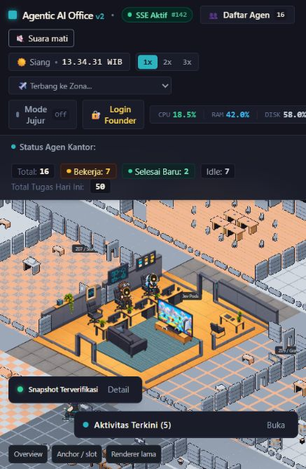
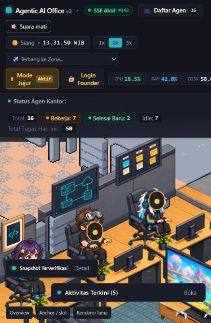

# Konsistensi karakter 2.5D — 5 Oktober 2026

User melaporkan karakter berubah kembali menjadi sprite lama saat berganti aksi, lalu meminta karakter tanpa aset 2.5D isometrik disembunyikan. Penyebabnya adalah resolver mengambil baseline untuk aksi yang belum ada; loader juga memuat seluruh 17 atlas karakter lama.

Renderer React/CSS sekarang hanya memuat atlas dari `characterOverrides`. Roster scene mensyaratkan atlas ilustrasi dan empat view idle asli, sehingga setiap arah memiliki pose aman dari agent yang sama. Kandidat aktif menampilkan **Prism, Forge, Nova**; 14 actor lain, termasuk Founder/Guest yang belum mempunyai aset baru, tidak dibuat. Daftar/telemetri agen tetap menggambarkan data store; angka 16 pada header bukan jumlah avatar yang tersedia. Registrasi agent VPS tidak diubah.

Saat animasi yang diminta tersedia, seluruh frame asli tetap digunakan. Saat belum tersedia, renderer menahan satu frame pose 2.5D dari agent dan arah yang sama: pose duduk di slot duduk jika tersedia, selain itu idle. Tidak ada fallback atlas lama, mirror, peminjaman avatar agent lain, atau pose sintetis. Actor tanpa artwork juga tidak mempunyai model/reservasi kursi dalam scene, sehingga tidak menghalangi kursi yang tampak kosong.

Forge masih belum mempunyai walk atau typing SW/NE/NW; saat berjalan, posisi model tetap bergerak dengan pose idle 2.5D. Game/aksi lanjutan juga belum menjadi animasi baru. Menahan pose mempertahankan identitas, bukan menyelesaikan produksi animasinya. Perbedaan hoodie pada walk Prism dari sumber sebelumnya tetap merupakan pekerjaan artwork lanjutan.

## Pemeriksaan yang dieksekusi

- **307 tes / 44 file lulus**, pengujian serial mulai 13:30:13 WIB, 93.62 detik. Termasuk semua aksi atlas lama × empat arah pada Prism/Forge/Nova, penggunaan frame nyata yang tersedia, penahanan pose duduk, penolakan atlas lama/view tidak lengkap, serta 120 detik simulasi ambient tanpa reservasi actor tersembunyi.
- Pengujian paralel pertama: 306 tes lulus, satu benchmark pathfinding gagal dengan rata-rata 1.274 ms versus batas 1 ms. Tidak ada perubahan kode pathfinding atau pelonggaran batas; suite diulang satu worker setelah build/lint selesai dan lulus seluruhnya.
- Build TypeScript + Vite exit 0; Vite 37.49 detik. Lint exit 0. Warning chunk Pixi lama 667.01 kB tetap ada.
- Browser yang sedang dipakai user berhasil diakses melalui CUA dan direload. DOM hanya memiliki tiga actor dengan URL atlas `/visual-migration/...`; `special` Prism/Forge memakai pose `sit_type`, dan `game` Nova memakai pose ilustrasi. Tidak ada sumber `baseline` pada actor yang diamati.
- Mode Jujur dites on/off dan dikembalikan off; kamera dikembalikan zoom 1x/Z08. Observasi DOM disimpan di [browser-actors.json](evidence/character-consistency-2026-10-05/browser-actors.json). Screenshot berikut benar-benar dari browser, bukan komposisi offline.
- Error hot reload sementara terjadi ketika state React lama belum memiliki field roster baru. Reload penuh memuat scene baru dengan tiga actor; tidak terjadi pada load penuh berikutnya. QA identitas berhasil, tetapi seluruh loop, kontak tangan/meja, dan perpindahan pose belum disertifikasi.

Log: [pengujian awal](evidence/character-consistency-2026-10-05/tests.log), [pengujian serial](evidence/character-consistency-2026-10-05/tests-serial.log), [build](evidence/character-consistency-2026-10-05/build.log), [lint](evidence/character-consistency-2026-10-05/lint.log).

Backup tracked source sebelum perubahan: `../Agentic-office-before-character-consistency-2026-10-05.zip`, SHA256 `f7d39bd071a63187c00310c6e8eb5e58b4a58eff3c0a39c61d6964175cb1a3b3`. Aset asli dan map/furniture tidak diubah pada perbaikan ini. Tidak ada push/deploy, akses VPS, worker produksi, atau perubahan gateway. Preview: [kantor lokal](http://127.0.0.1:5175/?officeRenderer=claude&seed=42).
