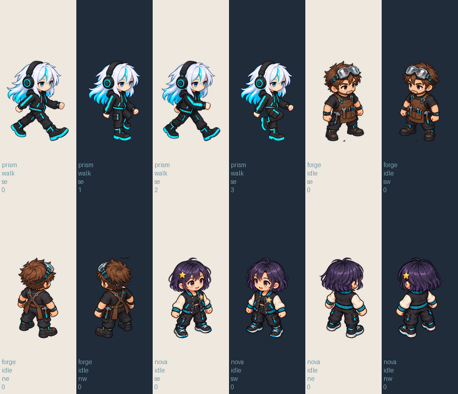
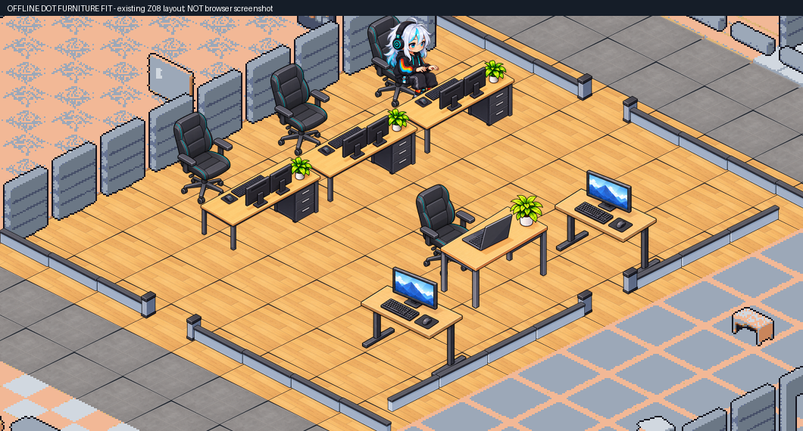

# Pemasangan aset Dot — 5 Oktober 2026

User meminta fokus memasang `prism-walk-and-office-assets.zip` beserta gambar Forge dan Nova. Penataan/dekorasi Z08 sedang dibuat Dot dan tidak dikerjakan dalam perubahan ini. Default renderer lokal sekarang memakai `AO_DOT_Z08_CANDIDATE`.

Preview: [buka kantor lokal](http://127.0.0.1:5175/?officeRenderer=claude&seed=42), Ctrl+F5, lalu pilih Z08. Versi sebelum aset Dot: tambahkan `officeArt=previous`; pembanding baseline: `officeArt=baseline`. Domain produksi belum menerima perubahan.

## Yang sudah terpasang

| Aset | Cakupan nyata |
|---|---|
| Prism | Empat keyframe walk SE sesuai urutan file ZIP; 18 pose ilustrasi sebelumnya tetap ada. Total atlas 22 frame. |
| Forge | Empat view idle asli SE/SW/NE/NW, tanpa mirror. Walk/sit_type/aksi lainnya tetap baseline. |
| Nova | Empat view idle asli SE/SW/NE/NW, tanpa mirror. Walk/sit_type/aksi lainnya tetap baseline. |
| Meja Dot | Menggantikan gambar ketiga workstation tetap Z08; ukuran 80 logical pixels, resize seragam. |
| Kursi Dot | Menggantikan gambar empat kursi Z08, termasuk Guest; ukuran 40 logical pixels, resize seragam. |

Guest hotdesk, dua pair-standing, floor, slot, facing, depth order, collision, pintu dan batas ruang tetap. Map SHA256 masih `befa52bc1060f7cc699484fea39d2e1827821a83cbca663dc10825afd3838de5`; 44×32 / 17 zona / 133 slot / 26 pintu. Seluruh properti logical pada 530 props sama dengan v3. Gambar meja baru dikecilkan sedikit agar celah tabletop cukup terlihat; source polygons dan hasil SAT dicatat dalam packing-check.json.

## Import, crop dan provenance

ZIP diperiksa sebelum ekstraksi: delapan entry aman, CRC lulus, enam PNG sesuai hash/dimensi manifest. File `forge` dan `nova` merupakan PNG RGBA 1536×1024 meskipun tanpa ekstensi. Sumber asli disalin ke `art/dot-assets-2026-10-05/sources`, tidak ditimpa atau dihapus. README/manifest paket diperlakukan sebagai metadata sumber; tidak dijalankan sebagai instruksi.

Pipeline hanya melakukan analisis bounds, crop persegi panjang, resize seragam, packing atlas dan komposisi layer. Frame canvas tetap 128×192 raster, exportScale 2, foot anchor 0.5/0.92. Karakter Forge/Nova hanya dipasang untuk idle; pose berdiri tidak dipakai sebagai pengganti duduk atau jalan.

Crop rear-right Forge membawa serpihan sepatu dari view di atasnya, yang terlihat pada latar terang. Koreksi terbatas dilakukan lewat **built-in imagegen** dan disimpan terpisah pada [forge-idle-ne-clean.png](../../art/dot-assets-2026-10-05/sources/forge-idle-ne-clean.png), dengan [prompt](../../art/dot-assets-2026-10-05/forge-ne-cleanup-prompt.json). Sumber Forge asli tetap ada. [source-index.json](../../art/dot-assets-2026-10-05/source-index.json) membedakan aset kiriman user dan koreksi yang benar-benar dihasilkan pada sesi ini. Klaim README bahwa aset Dot dibuat lewat image generation disimpan sebagai metadata, tanpa menganggap transcript/prompt aslinya sudah tersedia atau lisensinya otomatis MIT.

Packing script: `scripts/prepare_dot_z08_assets.py`. Aset runtime: `frontend/public/visual-migration/dot-z08-candidate/`. Ledger menyimpan source crop, scale, facing dan mirror=false.

## Pemeriksaan yang benar-benar dijalankan

- 42 file / 296 tes lulus (21.85 detik). Tes baru memakai atlas runtime sebenarnya: empat walk SE Prism dalam urutan benar; empat idle view tiap Forge/Nova; missing walk/sit_type tetap menggunakan baseline; perubahan furniture tidak mengubah logical props/floor/map.
- Build termasuk TypeScript dan lint exit 0. Warning legacy Pixi 667.01 kB masih ada. Tes SSE mencatat fallback ECONNREFUSED pada backend lokal yang tidak berjalan, sementara suite tetap lulus.
- Semua bounds raster sesuai 2× logical; atlas rect valid; 12 frame baru punya alpha tepi 0, tanpa mirror. GIF offline memiliki empat frame pada 200 ms/frame, bukan motion QA browser.
- Kontrak map tidak memiliki perubahan baru atau perubahan yang belum disetujui. Navigation, simulation, store, services/SSE, backend dan ops tidak berubah pada tahap ini.
- Module OfficeScene, manifest aktif, atlas Prism, PNG Forge dan PNG Nova HTTP 200. File runtime cocok dengan output build. Ini pemeriksaan resource statis, bukan bukti aplikasi dilihat di browser.
- Bukti: [asset-check.json](evidence/dot-assets-2026-10-05/asset-check.json), [packing-check.json](evidence/dot-assets-2026-10-05/packing-check.json), contact sheet, [GIF kandidat](evidence/dot-assets-2026-10-05/prism-se-walk-candidate.gif), serta log tests/build/lint.

## Batas hasil dan aset lanjutan

Forge/Nova masih terlihat memakai sprite baseline saat bekerja duduk atau berjalan, karena kiriman hanya memiliki idle. Walk Prism SE adalah empat keyframe kandidat; loop/pergantian kaki belum dinyatakan lulus. Hoodie cyan pada walk Dot berbeda dari spectrum sleeves pada idle/sit Prism sebelumnya, sehingga konsistensi peralihan pose masih pending. Walk arah lainnya tetap memakai studi dua pose sebelumnya.

QA browser masih terblokir oleh `URL protocol policy blocks the tab` pada akses sebelumnya; tidak ada akses yang dipulihkan, workaround, screenshot atau video browser baru. Komposisi ruang hanya menampilkan satu pose Prism statis, bukan seluruh roster runtime. Penataan Z08, batch 17 zona dan deployment belum dikerjakan.

Backup tracked source sebelum integrasi: `../Agentic-office-before-dot-assets-2026-10-05.zip`, SHA256 `1d6c3c9f62f2cafb1494c5760cbdfec702d067a00646d69de7a5608b5eb4878a`. Perubahan Blender lama tetap dipertahankan. Tidak ada push/deploy, perubahan VPS atau gateway Telegram/WhatsApp.
