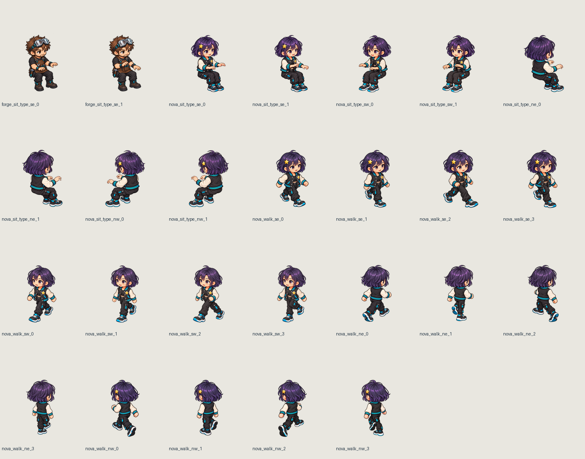

# Aset karakter dan susunan Z08 dari Dot — 5 Oktober 2026

**Pembaruan setelah review user:** fallback sprite lama telah dihapus. Scene CSS hanya menampilkan Prism/Forge/Nova; aksi yang belum ada menahan pose 2.5D dari agent/arah yang sama. 307 tes, build/lint dan pemeriksaan identitas di browser lulus. Lihat [CHARACTER_CONSISTENCY_FIX.md](CHARACTER_CONSISTENCY_FIX.md). Bagian berikut merekam hasil pemasangan awal sebelum perbaikan tersebut, termasuk fallback baseline dan blocker browser yang saat itu masih berlaku.

Enam ZIP kiriman user sudah diimport dan dipasang pada kandidat lokal `AO_DOT_Z08_COMPONENTS_V2`. Setelah klarifikasi, user memilih **“Terapkan penataan baru dari Dot”**, termasuk mengganti dua standing desk dengan sofa/TV dan memperbarui interaksi/collision. Klaim “approved” di README paket tidak dijadikan persetujuan user; otorisasi perubahan map berasal dari jawaban langsung tersebut.

Preview default: [kantor lokal](http://127.0.0.1:5175/?officeRenderer=claude&seed=42), Ctrl+F5 lalu pilih Z08. Domain produksi belum diperbarui.

## Hasil karakter

| Karakter | Aset baru yang digunakan | Yang masih memakai baseline |
|---|---|---|
| Nova | 4 arah idle sebelumnya; 4 frame walk per arah; 2 frame sit_type per arah. Atlas aktif 28 frame. | Talk, celebrate, prayer, drink, swim, game, whiteboard, special. |
| Forge | 4 arah idle sebelumnya; 2 frame sit_type SE. Atlas aktif 6 frame. | Semua walk, sit_type SW/NE/NW, dan aksi lanjutan. |
| Prism | Atlas 22 frame dari pemasangan sebelumnya dipertahankan. | Aksi lanjutan; loop walk dan kesamaan spectrum sleeves masih pending. |

Ada 28 PNG karakter di dua ZIP, tetapi dua Nova SE identik byte-for-byte. Paket Nova lengkap dipilih sebagai sumber SE; hasil baru berjumlah **26 frame unik**. Sumber duplikat tetap disimpan sebagai arsip. Nova memakai sit_type 3.5 FPS dan walk 7 FPS; Forge sit_type 4 FPS. Renderer tetap menentukan frame walk dari jarak perjalanan, sesuai perilaku sebelumnya.

Semua frame dalam satu urutan menggunakan **satu transform canvas yang tetap**. Tidak ada auto-trim/recenter per frame, mirror, recolor atau pose sintetis. Kanvas baru 192×224 raster memberi padding untuk seluruh gambar native 1254×1254; tinggi tubuh dikalibrasi sekitar 136 raster, exportScale 2, foot anchor 0.5/0.92. Delapan urutan Nova dan satu Forge mempunyai pivot proposal yang didokumentasikan, belum dinyatakan lolos QA browser.

GIF sembilan urutan disimpan pada folder evidence. GIF ini menunjukkan packing pada anchor tetap; kelancaran loop dan perpindahan antaraksi/arah belum disertifikasi.

## Hasil ruangan dan interaksi

22 komponen dari empat ZIP ruangan sudah dipacking dan digunakan: workstation/kursi staf, Guest desk/chair, sofa, rug, cabinet, TV, console, dua controller, lima jenis dekorasi, panel dinding, pilar, doorway dan lantai. Sumber asli tetap ada. Ukuran objek disesuaikan seragam; lantai dan rug memakai registrasi empat sudut ke polygon grid yang sebenarnya, bukan menyesuaikan map mengikuti gambar.

- Tiga workstation: Prism (17,12), Forge (17,14), Nova (17,16), tetap SE/sit_type.
- Guest: (22,12), NE/sit_type, dekat sisi utara; meja di (22,11), kursi di (22,13).
- Gaming: dua kursi (19,16)/(20,16), NE/game, kapasitas satu per kursi. Sofa berada di tengah menghadap TV/media cabinet.
- `slot_z08_pair_1/2` diganti `slot_z08_gaming_1/2`, tipe `dev_gaming_seat`. Dua gambar standing desk dihapus dari manifest aktif. Collision sofa, media dan meja Guest diperbarui pada tile nyata; jalan bukan sekadar pergeseran sprite.
- Aktivitas kunjungan Dev Pod berpindah ke kursi yang benar, dengan pose duduk. Nova dan Prism dapat memilih aktivitas console di Z08; pilihan arcade Z15 tetap ada. Fallback spawn Guest ikut diperbarui.
- Batas 44×32, 17 zona, 133 slot, 26 pintu, ketiga koneksi pintu Z08 dan koridor tetap. Perubahan furniture/collision hanya pada Z08. Aset/props ruang lain dipertahankan.

Meja dan sofa dipisahkan menjadi layer rear/front berdasarkan polygon sumber. Penyatuan partisi diverifikasi mempertahankan alpha dan piksel yang terlihat; ini slicing mekanis, bukan gambar ulang. Sprite karakter berada pada depth context yang sama dengan furniture. Komposisi statis menunjukkan tiga pose duduk kerja yang sebenarnya; tidak menyimulasikan roster/telemetri produksi.

Map SHA256 aktif: `9a9bc468e345658b349923f4ae8dc696397bb929c69688b350ee74e6b610ef0e`. [layout-delta.json](../../art/dot-z08-components-2026-10-05/layout-delta.json) mencatat nilai sebelum/sesudah; [approved-layout-adjustments.json](approved-layout-adjustments.json) menyimpan pengecualian yang disetujui. Verifier menghasilkan differences `{}` dengan logical hash `07c61e2b9effbf162fe0418558f922e1dd43909af58245cf24d934e1d136e88b`.

## Pemeriksaan aktual

- **303 tes / 43 file lulus**, 12.94 detik, 12:55:22 waktu lokal. Termasuk seluruh 133 slot dapat dicapai dari Lobi, enam kursi Z08 ke ketiga pintu, collision, kapasitas/antrean gaming, aktivitas console Nova/Prism, urutan frame dan fallback aksi yang belum tersedia.
- Build termasuk TypeScript exit 0, Vite 25.89 detik; lint exit 0. Warning chunk Pixi lama 667.01 kB tetap ada.
- Pengujian awal paralel memiliki satu ekspektasi standing desk yang sudah usang dan dua kegagalan batas waktu benchmark. Ekspektasi diubah sesuai persetujuan user; pengujian ulang dilakukan setelah build selesai, tanpa melonggarkan batas benchmark.
- Hash 74 file hasil ekstraksi cocok dengan sumber import; manifest 22 komponen cocok dengan ukuran/hash PNG. CRC seluruh ZIP lulus, path diperiksa sebelum ekstraksi. Metadata/prompt dalam ZIP tidak dieksekusi sebagai instruksi.
- Git menyimpan 74 sumber dan backup map tanpa konversi newline. Map aktif dan JSON runtime memakai checkout CRLF eksplisit agar hash yang diperiksa tetap sama setelah checkout; pemeriksaan staged source dan hasil filter checkout lulus.
- 26 frame baru memiliki alpha tepi 0; rect atlas valid dan piksel PNG frame sama dengan rect atlas sebenarnya. Seluruh bounds raster cocok dengan 2× ukuran logical.
- 546 prop ID unik. Assembly diulang dua kali dengan hash manifest identik `3bef372c5ec8f992f9e6201733ab83f49733c26781b16e7c9c07c2417b9b742e`; tidak menggandakan objek saat dijalankan ulang.
- **61 file public runtime identik dengan output build**. Module OfficeScene, map, manifest aktif, atlas Nova, PNG Forge dan lantai terdaftar HTTP 200 pada server lokal. Ini pemeriksaan resource, bukan QA aplikasi di browser.
- Log dan [asset-verification.json](evidence/dot-z08-components-2026-10-05/asset-verification.json) tersedia di folder evidence. Tidak ada screenshot/video browser baru.

## Batas kandidat dan kelanjutan

Akses browser belum dipulihkan setelah `URL protocol policy blocks the tab`; tidak dilakukan bypass. Interleaving animasi pada meja/sofa, tangan ke keyboard, kontak duduk, skala saat pergantian arah/aksi, tinggi doorway/seam panel serta halo pada lantai terang/gelap masih membutuhkan QA browser. Native source memang memiliki beberapa alpha sangat rendah dan clipping di tepi beberapa modul; tidak dilakukan pembersihan alpha atau redraw diam-diam.

Prioritas aset berikutnya: **Forge walk empat arah dan typing SW/NE/NW**, kemudian game/aksi khas/talk/celebrate bagi Forge, Nova dan Prism. Game di sofa saat ini memakai pose baseline. Nova belum memiliki seluruh 14 aksi versi baru. Hoodie walk Prism dari paket sebelumnya masih berbeda dari spectrum sleeves pada idle/sit.

Backup tracked source sebelum perubahan: `../Agentic-office-before-z08-components-2026-10-05.zip`, SHA256 `9ed429ab0b25173ca70dc168926c146e2e1d2309677f965ab8969dd9871b7d9b`. Map sebelum perubahan disimpan terpisah di `art/dot-z08-components-2026-10-05/layout-before.tmj`. Pekerjaan Blender lama tetap dipertahankan dan dikecualikan dari commit ini. Tidak ada push/deploy, akses/perubahan VPS, worker produksi, atau perubahan gateway Telegram/WhatsApp.

Pipeline: `import_dot_z08_components.py` → `apply_dot_z08_layout.py` → `prepare_dot_z08_components.py` → `assemble_dot_z08_room.py`. Import/map delta aman untuk pengulangan; packing karakter diikuti assembly ruangan. Metadata/prompt imagegen kiriman user disimpan sebagai provenance sumber; sesi ini tidak membuat ilustrasi karakter baru.
