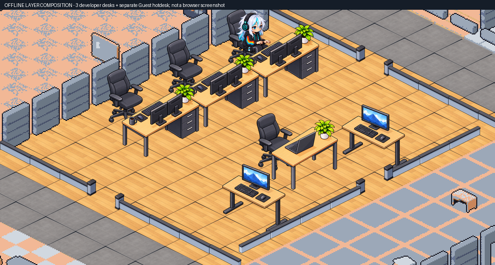

# Z08: tiga meja utama dan hotdesk terpisah — 5 Oktober 2026

User menyetujui usulan menghapus workstation keempat dari deretan utama dan memakai hotdesk sementara yang terpisah bila diperlukan. Susunan lokal sekarang memiliki tiga workstation tetap untuk Prism, Forge, dan Nova. Slot Guest tetap tersedia pada meja kecil dengan satu laptop di sisi ruangan; dua meja pair-standing yang sudah ada tetap dipertahankan.

Default preview: [buka Z08](http://127.0.0.1:5175/?officeRenderer=claude&seed=42), lalu refresh penuh (Ctrl+F5). Manifest aktif AO_ILLUSTRATED_2D_Z08_V3. Produksi publik belum menerima perubahan ini.

## Perubahan yang disetujui

| Bagian | Sebelum | Sesudah |
|---|---|---|
| Slot Guest, ID tetap | gx17 / gy18 | gx21 / gy15 |
| Tile meja Guest | gx16 / gy18 | gx22 / gy15 |
| Tile kursi Guest | gx18 / gy18 | gx20 / gy15 |
| Collision meja | gx16 / gy18 solid | gx22 / gy15 solid |
| Roster fallback Guest | gx17 / gy18 | gx21 / gy15 |

Facing SE, sit_type, y_offset -6, kapasitas dan identitas slot tetap. Generator map ikut diperbarui agar regenerasi tidak mengembalikan deretan empat meja. Ini pengecualian terbatas terhadap kontrak denah sebelumnya, dicatat dalam [approved-layout-adjustments.json](approved-layout-adjustments.json). Baseline asli tidak diganti. Verifier menerapkan hanya perubahan yang diizinkan ke salinan baseline dan menolak perubahan lain pada furniture, collision, zona, pintu atau slot.

Denah tetap 44×32, dengan 17 zona, 133 slot dan 26 pintu. Batas ruangan, kedua koridor, tiga slot staf serta dua pair-standing tetap. Pemeriksaan seluruh JSON map memastikan perubahan hanya empat sel furniture, dua sel collision dan koordinat slot Guest (termasuk titik Tiled). Floor baseline byte-identical dengan sebelumnya.

## Bukti yang benar-benar diperiksa

- 41 file / 293 tes lulus. Tes baru memakai GridMap/AStarPathfinder yang digunakan aplikasi: semua 133 slot terjangkau dari lobi; Guest dapat dicapai dari ketiga pintu Z08 tanpa memotong sudut collision.
- Build termasuk TypeScript dan lint exit 0. Warning chunk legacy Pixi 667.01 kB masih ada.
- Tes SSE mencatat pesan fallback `ECONNREFUSED` karena backend lokal tidak berjalan; kelima tes SSE tetap lulus. Hasil suite ini tidak membuktikan koneksi telemetry produksi.
- Generator furniture/collision sama persis dengan map hasil edit. Kontrak tidak memiliki perubahan yang belum diizinkan.
- 71 file public v3 cocok byte-for-byte dengan output build. Resource halaman, map, manifest v3 dan hotdesk HTTP 200 pada server lokal port 5175. Ini pemeriksaan resource statis, bukan QA browser.
- Komposisi offline ruang dan kedua pose Guest baseline pada latar terang/gelap ditinjau. Meja utama mempertahankan celah antar-tabletop hasil koreksi v2.
- [asset-check.json](evidence/illustrated-z08-v3/asset-check.json), [orientation-check.json](evidence/illustrated-z08-v3/orientation-check.json), [layout-verification.json](layout-verification.json), [preview-server.json](evidence/illustrated-z08-v3/preview-server.json), dan log build/lint/tests menyimpan hasil eksekusi.

Map SHA256: befa52bc1060f7cc699484fea39d2e1827821a83cbca663dc10825afd3838de5.

## Aset, provenance dan batas hasil

Hotdesk dibuat memakai **built-in imagegen**, dengan meja SE v2 dan kedua referensi user. Iterasi kedua dipilih; source awal dipertahankan. Gambar final sumber: [hotdesk-se-taller.png](../../art/illustrated-z08-v3/sources/hotdesk-se-taller.png); aset runtime: [hotdesk.png](../../frontend/public/visual-migration/illustrated-z08-v3/hotdesk.png). Prompt: [prompts.json](../../art/illustrated-z08-v3/prompts.json) dan [hotdesk-refinement-prompt.json](../../art/illustrated-z08-v3/hotdesk-refinement-prompt.json). Hash dan asal tool: [source-index.json](../../art/illustrated-z08-v3/source-index.json). Packing hanya crop/resize seragam/komposisi mekanis; source alpha dipertahankan.

Browser tool sebelumnya menolak tab dengan alasan `URL protocol policy blocks the tab`; akses belum pulih. Tidak ada screenshot/video browser baru atau klaim motion/occlusion runtime lulus. Gambar di atas adalah komposisi statis dengan satu pose Prism, bukan roster runtime. Guest masih memakai sprite baseline sehingga gayanya berbeda dari Prism; kedua pose baseline diperlihatkan pada [guest-hotdesk-light-dark.png](evidence/illustrated-z08-v3/guest-hotdesk-light-dark.png).

Walk cycle lengkap, karakter/aksi lain, batch 17 zona dan penerimaan visual runtime tetap pending. Persetujuan user untuk alignment v2 serta susunan tiga meja ini tidak dianggap sebagai penerimaan semua aset atau seluruh migrasi.

Backup tracked source sebelum perubahan: `../Agentic-office-before-three-dev-desks-2026-10-05.zip`, SHA256 `30cd9843a0761504f5f54af49d1cd64eefda0c752d2709e099e274332f74dc75`. Perubahan Blender lama yang belum committed tetap dipertahankan. Tidak ada push, merge, deploy, perubahan VPS/gateway atau worker produksi.
